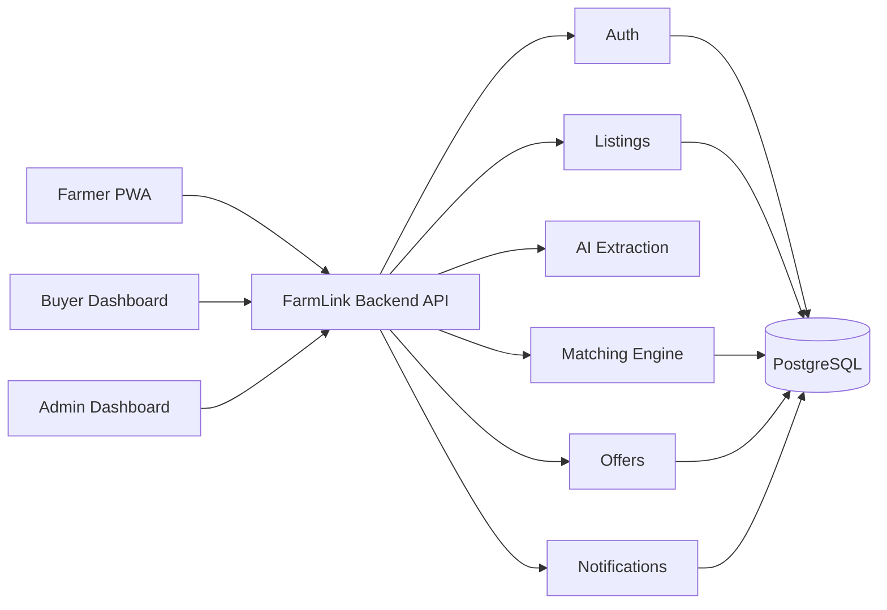

# FarmLink AI

FarmLink AI is a Ghana-focused agricultural marketplace and produce-matching platform that connects
farmers with buyers (restaurants, hotels, schools, supermarkets, traders, processors, wholesalers and
bulk individuals). Farmers describe produce in plain language; the system extracts structured data,
publishes a listing, matches suitable buyers with a transparent scoring engine, and supports offers,
transactions and shared-transport suggestions.

This is a **monorepo** containing the backend API and the frontend(s).

```text
.
├── backend/     # Node + TypeScript + Express + Prisma + PostgreSQL API (see backend/README.md)
├── frontend/    # Vite + React frontend (see frontend/README.md)
├── render.yaml  # Render Blueprint: PostgreSQL + backend web service
└── README.md
```

## Architecture



## Quick start (local)

```bash
# 1. Backend
cd backend
cp .env.example .env            # set JWT_ACCESS_SECRET + DATABASE_URL
npm install
docker compose up -d postgres   # or point DATABASE_URL at Supabase/Neon
npm run prisma:generate
npm run prisma:deploy
npm run prisma:seed
npm run dev                     # http://localhost:4000  (docs: /api/docs)

# 2. Frontend (in a second terminal)
cd ../frontend
cp .env.example .env            # set VITE_API_BASE_URL (local or Render)
npm install
npm run dev                     # http://localhost:5173
```

Full backend docs: [`backend/README.md`](backend/README.md). Frontend connection guide:
[`frontend/README.md`](frontend/README.md).

## Deploying to Render

The repo includes a [`render.yaml`](render.yaml) Blueprint that provisions a managed PostgreSQL
database and the backend web service (built from `backend/`).

### One-time setup

1. Push this repository to GitHub.
2. In Render, click **New → Blueprint** and select this repository. Render reads `render.yaml` and
   creates the `farmlink-db` database and the `farmlink-api` web service.
3. Set the env vars marked `sync: false` in the dashboard:
   - **`CORS_ORIGINS`** — your frontend URL(s), comma-separated (e.g.
     `https://your-frontend.onrender.com,http://localhost:5173`).
   - **`ADMIN_PASSWORD`** — a strong admin password (used by the seed).
   - Optionally `AI_API_KEY` / `AI_MODEL` if you wire up an external LLM (defaults to the offline
     local provider).
   - `JWT_ACCESS_SECRET` and `DATABASE_URL` are generated/linked automatically.
4. Deploy. The build runs `npm ci && prisma generate && build`; the service starts with
   `prisma migrate deploy && npm start` and is health-checked at `/health`.

### Seeding the deployed database (optional, for demos)

From the Render service **Shell**:

```bash
cd backend && npm run prisma:seed
```

### Notes for Render

- The backend binds to `process.env.PORT`, which Render provides automatically.
- Node 20 is pinned via `backend/.node-version`.
- Migrations are applied on every deploy (`prisma migrate deploy`), so schema changes ship safely.
- Once deployed, the API base URL for the frontend is `https://<service>.onrender.com/api/v1` and
  Swagger is at `https://<service>.onrender.com/api/docs`.

### Deploying the frontend

After you scaffold the frontend, add it to `render.yaml` as a **static site** (for SPAs) or a second
web service (for SSR), set its `VITE_API_BASE_URL` (or framework equivalent) to the deployed backend
URL, and add that frontend origin to the backend's `CORS_ORIGINS`.

## What the frontend team needs to connect

1. Base URL: `<backend>/api/v1`.
2. The typed client in `frontend/src/api/` (auth, listings, extraction, marketplace, offers, matches).
3. Auth: bearer token from `/auth/login`; roles `FARMER` / `BUYER` / `ADMIN`.
4. Consistent JSON envelope (see `frontend/README.md`).
5. Interactive docs at `/api/docs` and OpenAPI at `/api/docs.json`.
6. Their origin added to the backend `CORS_ORIGINS`.

## Demo credentials (development only)

| Role | Email | Password |
| --- | --- | --- |
| Admin | `admin@farmlink.local` | `AdminPassword123!` |
| Farmer | `farmer@farmlink.local` | `FarmerPassword123!` |
| Buyer | `buyer@farmlink.local` | `BuyerPassword123!` |
